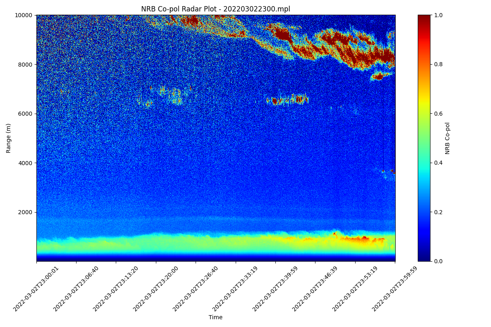
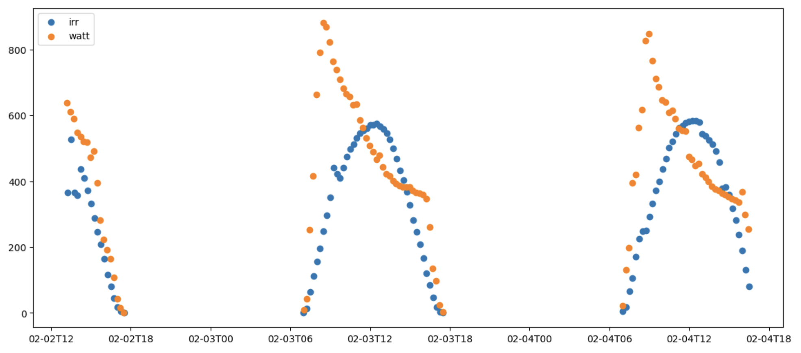
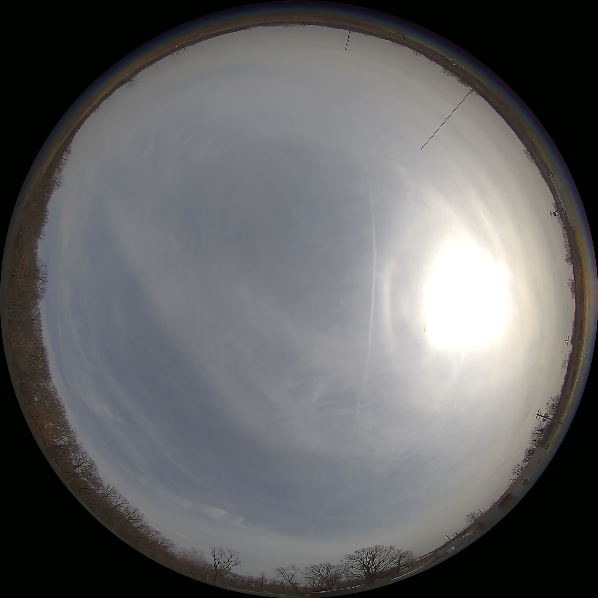
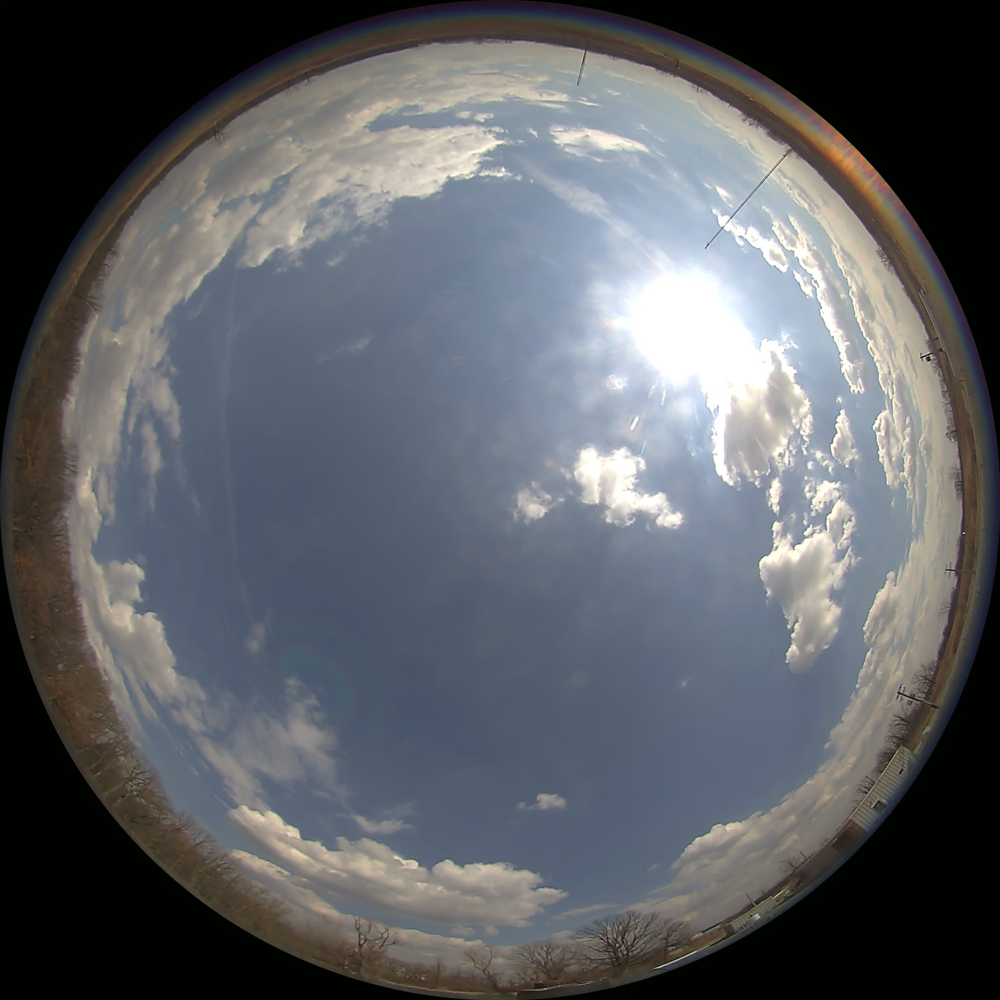
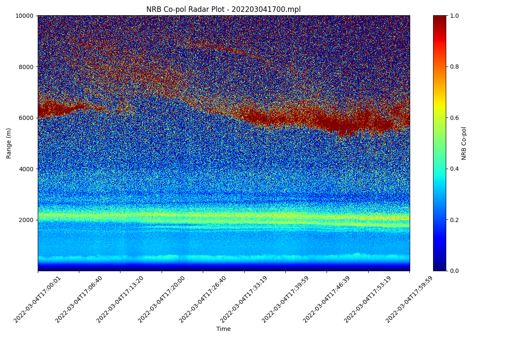
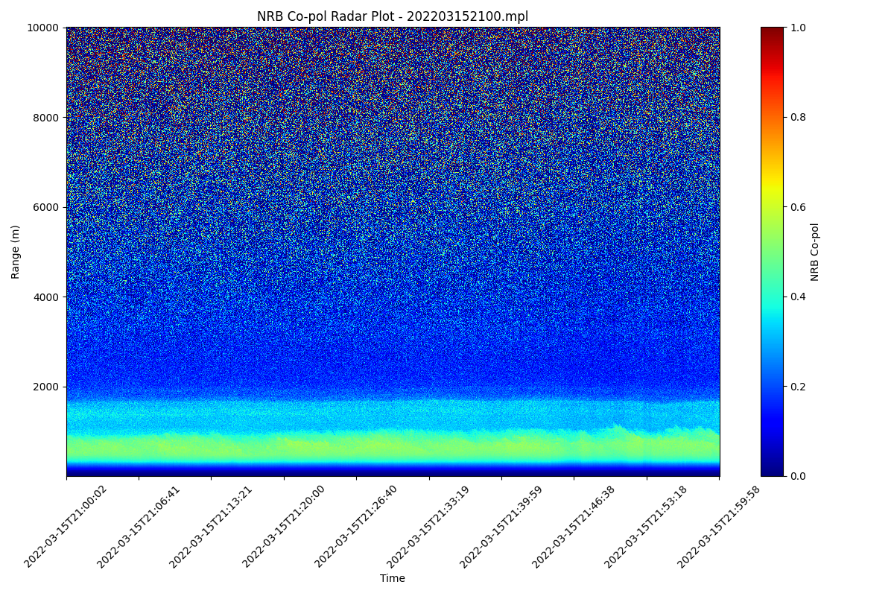
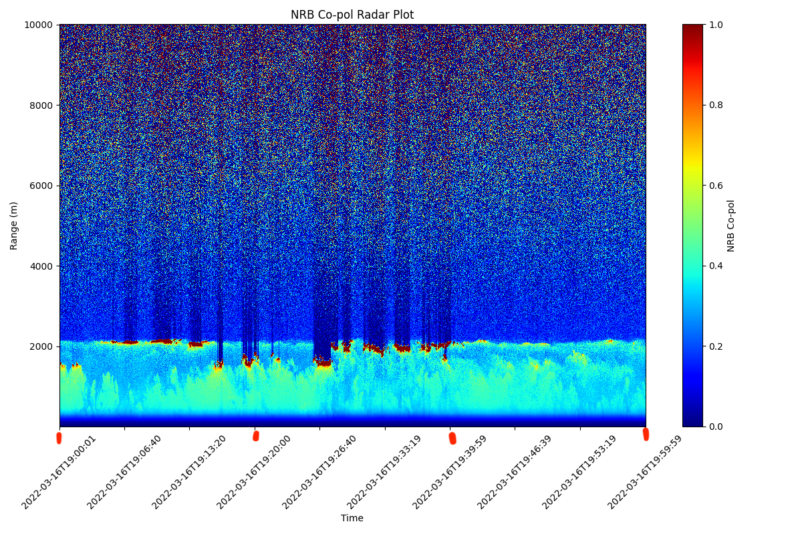
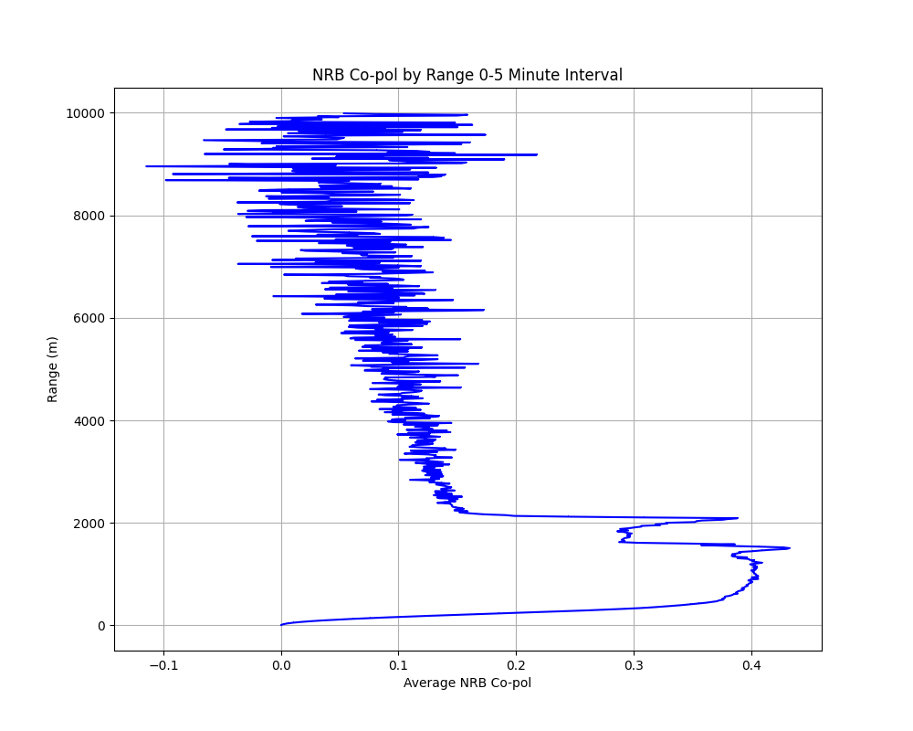
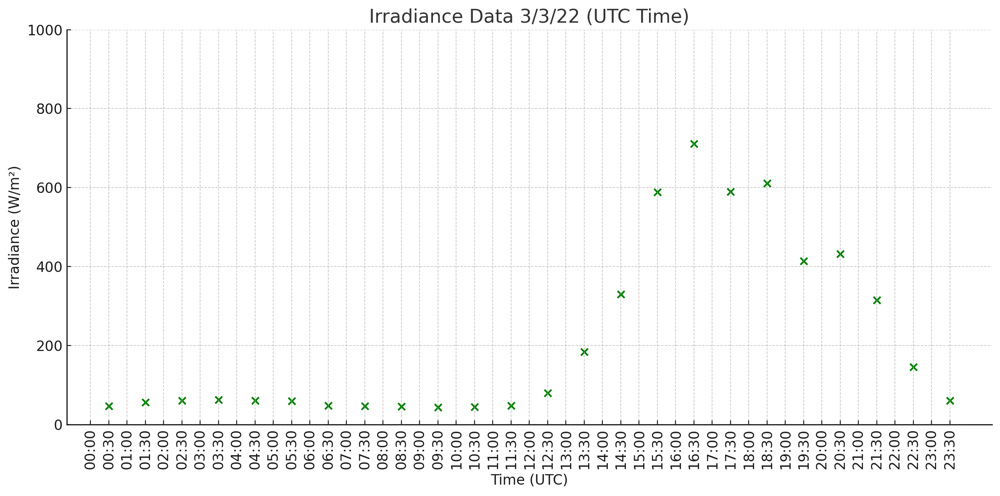

# Using LIDAR to Aid Models in Solar Estimation and Sky Classification

LIDAR technology, with its ability to create detailed maps of atmospheric environments, can potentially solve the issue of blockers by providing precise information about the location and height of obstructions. It proposes many benefits that can’t be offered by a regular camera, especially the fact that it provides accurate data in all different types of weather conditions including fog, rain, and low light. This information can be used to adjust solar irradiance estimates and sky predictions, making them more accurate in any setting. Current models experience difficulties in the presense of blockers and unfamiliar sky conditions. We believed LiDAR could potentially solve this issue and allow us to deploy these nodes in urban areas.

## Motivation
The goal or purpose behind this project was to develop a machine learning model using image and LiDAR data to accurately predict sky conditions and estimate solar irradiance even in the presence of ”blockers” and unfamiliar sky conditions found commonly in urban areas. 

## Methods
The steps we took towards completing this goal primarily were building models, gathering data, and also understanding the data. We used the pretrained models from the PyTorch model library, specifically the ResNet models, and did transfer learning on these models for sky classification and solar irradiance. We gathered data for my datasets using the SAGE nodes in Illinois and understood what they meant by speaking to professionals on the topics.

## Problems & Results
A major problem occurred when we were trying to gather solar wattage data. We naturally assumed wattage and irradiance to follow similar trends, but we found they shared little correlation with each other. Wattage peaks early in the morning and is generally higher than irradiance which is very abnormal. 

Due to this we looked more into the sky classification aspect of this research. We built a model that predicted whether the image was clear sky, 0, or other, 1. Some hyperparameters we chose included ResNet50 pretrained, Cross-Entropy Loss Function, and Adam Optimizer. The ResNet50 model performed well, receiving 98% test accuracy with recall and precision above 97% for both classes. This is where we encountered our next big problem. We were unable to represent the sky condition in numbers with the LiDAR data, so we chose to just find the correlation or relationship between irradiance data, images, and corresponding LiDAR data. This would help to prove the benefit of LiDAR in predicting sky conditions, and consequently solar data. Our original plan was to use LiDAR data to divide the ”other” class in the sky classification model into more descriptive classes like cloudy, thick overcast, hazy, etc.

## Findings

| Hazy | Clear | Cloudy |
|---------------------|----------------------|-----------------------|
|  |  |  |

| 1hr LiDAR Hazy  | 1hr LiDAR Clear | 1hr LiDAR Cloudy |
|---------------------------------------|---------------------------------------|--------------------------------------|
|  |  |  |

| 1st 5min Average Signal Intensity Hazy | 1st 5min Average Signal Intensity Clear | 1st 5min Average Signal Intensity Cloudy |
|-----------------------------------------------------------|-------------------------------------------------------------|-------------------------------------------------------------|
|  |  |  |

| Irradiance Hazy | Irradiance Clear | Irradiance Cloudy |
|----------------------|-----------------------|----------------------|
|  |  |  |

Hazy
- Solar irradiance is much lower peaking around 600 W/m2
- LiDAR plots show high intensity values around 6,000m where clouds are detected
- Average signal strength shows a drastic peak similarly around 6,000m.
  
Clear
- Solar irradiance peaks the highest at around 1,000 W/m2
- LiDAR plots show low intensity values or no clouds,
- Average signal strength shows no drastic peaks, tiny oscillations toward 10,000m
  
Cloudy
- Solar irradiance peaks around 700 W/m2
- LiDAR plots show some high intensity values, meaning dense cloud particles detected, at about 2,000m 
- Average signal strength shows little peaks around 2000m, and past this height there are some very scattered cloud particles detected, creating those large oscillations

Although I could not put all of the sky conditions and their observations, it is clear from these few examples that using LiDAR data helps better classify a sky condition. 2D images of the sky work in many conditions. Though, when features in the image are unrecognizable or unfamiliar to the model, LiDAR data can be used to disambiguate. 

## Conclusions & Future Work
Although a ML model was not created in these 10 weeks, based on the correlation between LiDAR data, image, and solar irradiance data, we can say that LiDAR data is very beneficial in the prediction of sky conditions and the estimation of solar irradiance. It should be used in pair to the images. In the future, we hope to convert LiDAR data into numerical values that represent sky conditions. Solving this issue will allow us to create a dataset and, subsequently, develop a model that incorporates both image and LiDAR data. This model would be able to classify sky conditions and eventually estimate solar irradiance, very accurately.

